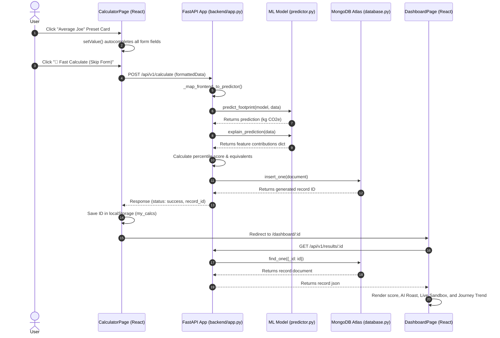
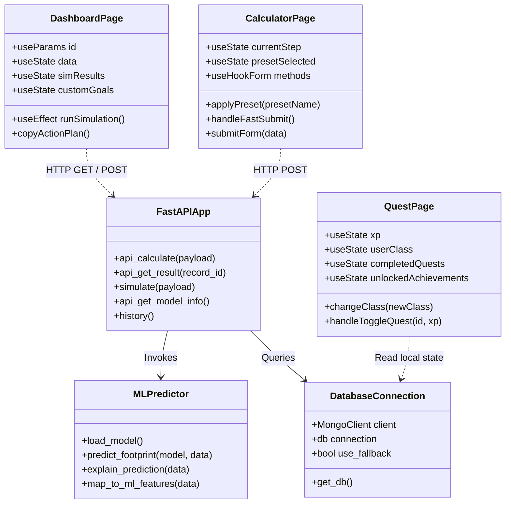

# CarbonCast — Full Technical System Documentation

Welcome to the comprehensive technical documentation for **CarbonCast**, an AI-powered carbon footprint estimator, dynamic sandbox simulator, and personalized sustainability tracker.

---

## 1. The 5W + 1H Product Framework

The 5W + 1H framework defines the purpose, design decisions, and core architecture of CarbonCast:

*   **WHO (Target Audience & Systems)**: 
    CarbonCast is designed for individuals, households, and eco-conscious citizens who want a realistic understanding of their environmental impact. From a system perspective, it connects a React (Vite) frontend client to a FastAPI (Python) backend server, storing calculations in a MongoDB Atlas database. It operates with zero registration requirements to preserve complete user privacy.
*   **WHAT (Core Solution)**: 
    It is a machine-learning-driven carbon estimator. Instead of using generic multiplication rules, it maps 11 lifestyle inputs to a trained Linear Regression model to calculate annual emissions, provides a real-time sandbox to simulate lifestyle changes, roasts high footprints with witty AI messaging, and tracks progress locally.
*   **WHEN (Usage Milestones)**: 
    Users immediately get their carbon score using 2-click lifestyle presets. During their session, they adjust sandbox sliders to identify realistic targets and export their checklist. Long-term, they return periodically (e.g., bi-weekly) to recalculate and log their progress on a local journey trend chart.
*   **WHERE (Hosting & Storage)**: 
    The application runs locally on standard web browsers. The backend API is hosted on port 5000 and the frontend on port 5173. Calculation history is saved in a secure MongoDB Atlas cloud cluster, while individual milestones, quest progress, and calculation IDs are cached locally in the browser's `localStorage` to maintain user anonymity.
*   **WHY (Problem & ML Advantage)**: 
    Traditional carbon calculators are boring spreadsheets that rely on static, linear assumptions. CarbonCast uses machine learning to find complex multivariable correlations in real-world lifestyle data (such as how travel distance interacts with fuel type or how diets offset waste). This enables personalized estimations, Explainable AI breakdowns, and interactive gamified tracking.
*   **HOW (Process Flow)**: 
    Inputs are collected via synchronized range sliders and number inputs. The backend pre-processes this data, runs it through a trained Scikit-Learn pipeline (`model.pkl`), calculates the mathematical contribution of each variable, stores the record, and renders the interactive dashboard results.

---

## 2. Data Analysis & The Machine Learning Pipeline

### Data Analysis Overview
We analyzed a dataset of 500 records representing diverse community lifestyles (`dataset/carboncast.csv`) to understand what factors most heavily drive carbon emissions. The analysis revealed that:
*   **Weekly Commutes**: Driving petrol or diesel vehicles is the leading daily source of emissions, whereas walking, cycling, or using public transit significantly lower the total.
*   **Airplane Travel**: Annual flights add a substantial, non-linear spike to a user's footprint.
*   **Dietary Choices**: Mixed meat diets add carbon, while vegan and vegetarian lifestyles act as negative/offsetting factors.
*   **Utility Bills**: High electricity consumption is directly tied to heavy AC use.
*   **Tree Offsets**: Planting trees acts as a direct negative emissions factor, offsetting footprints.

### Understanding Regression & Linear Regression
In machine learning, **Regression** is a task where a model is trained to predict a **continuous numerical value** (like a footprint in kilograms of CO₂) rather than classifying inputs into categories (like "High" or "Low").

**Linear Regression** calculates a baseline footprint (the intercept) and then adds or subtracts weight based on the user's choices. It finds the mathematically optimal "line of best fit" through the dataset. The relationship is represented as:

\[Y = \beta_0 + \beta_1 X_1 + \beta_2 X_2 + \dots + \beta_n X_n + \epsilon\]

Where:
*   \(Y\): Predicted carbon footprint (`Total_CO2e` in kg).
*   \(\beta_0\): The intercept (**93.1853 kg**), representing the baseline emissions of a user.
*   \(\beta_i\): Learned coefficients (weights) for each lifestyle choice \(X_i\). For example, every kilometer driven ($X_1$) adds $+0.0861\text{ kg}$ to the target footprint, while a vegan diet ($X_4$) subtracts $-0.0133\text{ kg}$ from it.

### Explainable AI (XAI)
Because the model is linear, we can calculate the **exact contribution** of each answer to the user's score:
\[\text{Contribution}_i = \beta_i \times X_i\]
Instead of keeping the AI's predictions a mystery, the dashboard displays these values in the **AI Driver Analysis** chart, showing the user exactly how many kilograms of carbon each of their habits added or subtracted.

---

## 3. UML System Diagrams

### A. Use Case Diagram
```mermaid
usecaseDiagram
    actor User as "Citizen / User"
    
    package CarbonCastSystem as "CarbonCast Portal" {
        usecase UC1 as "Autofill Lifestyle Presets"
        usecase UC2 as "Calculate Carbon Footprint"
        usecase UC3 as "Trigger Skip-Form Estimate"
        usecase UC4 as "Run What-If Simulations"
        usecase UC5 as "View AI Climate Roast"
        usecase UC6 as "Copy Custom Action Plan"
        usecase UC7 as "Track Carbon Journey History"
        usecase UC8 as "Complete Class-Specific Quests"
        usecase UC9 as "Download PDF Report"
    }

    User --> UC1
    User --> UC2
    User --> UC3
    User --> UC4
    User --> UC5
    User --> UC6
    User --> UC7
    User --> UC8
    User --> UC9
```

### B. Sequence Diagram


### C. Class / Component Diagram


---

## 4. Frontend Specifications & Features

The user interface is built using **React, Vite, TypeScript, and Tailwind CSS**. It focuses on reducing entry friction, displaying interactive results, and encouraging repeat usage:

1.  **Lifestyle Presets (Quick Start)**:
    Step 0 features preset cards (`Eco-Champion`, `Average Joe`, `High Consumer`). Clicking a card instantly autocompletes the form inputs using pre-defined templates.
2.  **Form-Bypass Fast Calculate**:
    Allows users to click a preset and hit **"🚀 Fast Calculate"** to submit the estimation immediately, bypassing the 11-question wizard in just 2 clicks.
3.  **Synchronized Visual Sliders**:
    Pairs range sliders and numeric input boxes with synchronized states. Features real-time descriptive tags (e.g. *"Heavy AC Usage"*) to make numbers easy to understand.
4.  **Live What-If Simulation Sandbox**:
    Interactive sliders on the dashboard let users adjust reduction percentages (e.g., *“Reduce travel mileage by 20%”*). The app queries the backend simulator real-time and shows updated carbon predictions and saved emissions.
5.  **Journey Progress Line Chart**:
    Plots a chronological line chart of the user's historical scores. It filters global calculations against a list of saved IDs in the browser's `localStorage` (`my_calcs`), creating a visual incentive to return and re-calculate.
6.  **Humorous AI Climate Roast & Review**:
    Displays a humorous, satirical assessment of the user's carbon footprint based on their score (e.g., joking about penguins sending bills to high emitters), making the results engaging.
7.  **Class-Based Personalized Quests**:
    Assigns users to an Eco-Class (*VIP*, *Pragmatist*, or *Guardian*) based on their score. Features custom quests that are dynamically filtered using their calculator answers, automatically hiding inapplicable tasks (like AC or flight offsets if they don't own an AC or fly).
8.  **Action Plan Clipboard Exporter**:
    Pre-populates a checklist based on their inputs, lets them add custom goals, and copies the plan to their clipboard in clean Markdown to save in their personal notes.
9.  **Downloadable PDF Reports**:
    Allows users to download a professional PDF report containing their score, equivalents, breakdown charts, and recommendations.

---

## 5. Backend Specifications & Data Flow

The backend is built using **FastAPI** and **Uvicorn**, serving as the central coordinator for predictions, database writes, simulations, and PDF generation:

1.  **ML Inference Engine (`predictor.py`)**:
    Loads the Scikit-Learn pipeline (`model.pkl`) to make predictions and compute individual feature coefficients during calculations.
2.  **Simulation Engine (`simulator.py`)**:
    Calculates carbon reductions for sandbox queries.
3.  **MongoDB Connection (`database.py`)**:
    Connects to the MongoDB Atlas cluster to log and retrieve calculations. Automatically falls back to an in-memory dictionary database if the cloud cluster is unreachable.
4.  **PDF Report Compiler (`report.py`)**:
    Generates static pie and bar charts, compiles recommendation summaries, and builds a printable PDF report.

---

## 6. Execution & Setup

### Running Backend
```bash
cd backend
pip install -r requirements.txt
python -m uvicorn app:app --host 0.0.0.0 --port 5000
```

### Running Frontend
```bash
cd frontend
npm install
npm run dev
```
