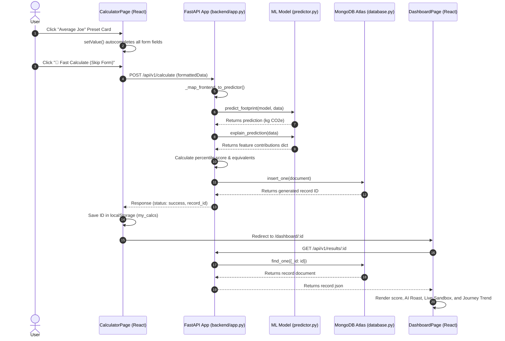
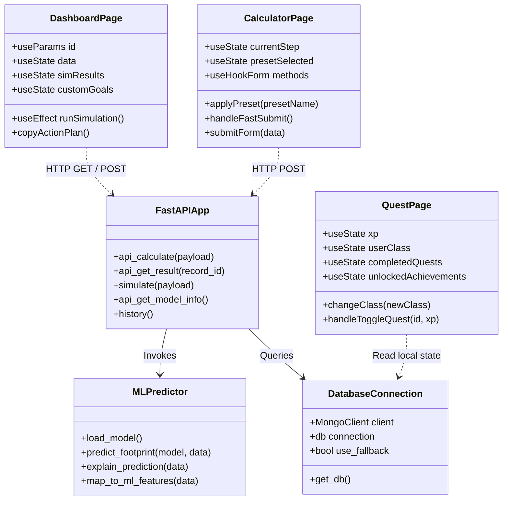

# CarbonCast — Full Technical System Documentation

Welcome to the comprehensive technical documentation for **CarbonCast**, an AI-powered carbon footprint estimator, dynamic sandbox simulator, and personalized sustainability tracker.

---

## 1. The 5W + 1H Product Framework

The 5W + 1H framework defines the purpose, design decisions, and core architecture of CarbonCast, with a strong focus on user psychology, engagement, and retention:

*   **WHO (Target Audience & Demographic Focus)**:
    *   **Demographic Profile**: CarbonCast targets sustainability enthusiasts aged **30 to 50**. This cohort consists of values-driven professionals, home/property owners, and family leaders who possess both the financial agency and decision-making power to execute structural lifestyle offsets (such as installing solar roofs, selecting electric vehicles, or adjusting household energy grids).
    *   **User Personas**:
        *   *The Pragmatist*: Seeks cost-saving energy adjustments (e.g., lower electricity bills via LEDs or HVAC optimization) alongside measurable carbon savings.
        *   *The Guardian*: Highly committed to active environmental conservation; motivated by community visibility, streaks, and systemic carbon tracking.
        *   *The Showcaser*: Competes on leaderboards, shares green wins to social circles, and is motivated by gamified achievements and peer validation.

*   **WHY (The Psychological Core & User Relevance Loop)**:
    *   *Why calculate the annual baseline in the first place?*
        *   Establishing an **Eco-Baseline Profile**: Just as a fitness tracker requires a baseline weight and height to create a tailored regime, a user needs an initial carbon score (e.g. "9.4 tonnes CO₂/yr") to establish their environmental starting point. It provides immediate self-awareness and quantifies their contribution to global greenhouse gas metrics.
    *   *Why return to log actions again? why is it relevant over time?*
        *   Traditional carbon calculators are "single-visit dead-ends"—once a user learns their annual number, they have no reason to return. CarbonCast solves this retention gap by splitting the product into a **one-time baseline onboarding** and a **daily avoided emissions ledger**:
            1.  **Streaks & Daily Habits**: Users visit daily to log concrete actions (e.g., cycling to work, zero-waste dinners) using the natural language win parser. This builds a visual "Streak Fire" count, driving daily habit formation.
            2.  **Avoided vs. Baseline Emissions**: Recalculating the baseline is tedious. Instead, the application tracks *avoided* emissions in real-time. Logging a win immediately subtracts kilograms from their estimated daily target, visually demonstrating the compounding impact of micro-actions.
            3.  **Social Accountability (The "Reddit for the Planet")**: Users want peer verification. By sharing green wins to the community feed, connecting with leaders (like John Abraham and Dia Mirza), and competing on local quest boards, users transform climate isolation into collective gamified action.

*   **WHAT (The Core System Architecture)**:
    *   An integrated ecosystem comprising:
        1.  **AI Estimator**: A trained Linear Regression pipeline that estimates the initial annual carbon baseline based on 11 lifestyle inputs.
        2.  **Natural Language Green Win Parser**: A client-side semantic parser that translates text posts (e.g., "I rode my bicycle to work") into classified category tags and numerical carbon offsets.
        3.  **Social Community Feed**: A dynamic feed allowing users to publish parsed wins, view connection cards, check other user profiles, and connect.
        4.  **Carbon Quest & Streak Engine**: Dynamic, class-specific dashboards allocating quests and monitoring daily activity streaks.

*   **WHEN (Usage Lifecycle)**:
    *   *Phase 1 (Onboarding - Year 0)*: User completes the 2-click preset signup and initial baseline scorecard.
    *   *Phase 2 (Daily Check-in)*: User logs a green win via natural language, checks the community feed to see what others did, and updates their daily streak.
    *   *Phase 3 (Weekly Quest Review)*: User completes class-specific quests (e.g., "Meatless Week") to unlock XP milestones.
    *   *Phase 4 (Periodic Simulation)*: User opens the sandbox simulator on their dashboard to visualize how permanent lifestyle changes (like buying an EV) will lower their baseline annual scorecard over time.

*   **WHERE (Systems Architecture)**:
    *   A secure, decoupled hybrid application:
        *   *Frontend Client*: React, Vite, Tailwind CSS, and Supabase Auth client, hosted on Vercel.
        *   *Backend API*: FastAPI and Uvicorn, hosted on Render.
        *   *Storage Layer*: MongoDB Atlas (persisting users, checklist states, and social posts) and browser `localStorage` (caching local calculator tokens and quest states).

*   **HOW (Engagement Mechanics)**:
    *   User signs up via Supabase Auth.
    *   The frontend intercepts the session, passes the Supabase JWT to the backend, and automatically synchronizes their profile to MongoDB.
    *   Daily green actions are parsed semantically on the client and logged to the MongoDB posts collection.
    *   Dynamic dashboards render carbon totals, glowing donut category breakdowns, and AI-driven recommendations.

---

## 2. AI & Machine Learning Engineering Deep-Dive

### Why Machine Learning Matters for Carbon Footprints
Traditional carbon calculators rely on fixed multipliers (e.g. `1 km commuted = 0.2 kg CO₂`). This is rigid and inaccurate because it fails to capture multivariable interactions. In the real world, your carbon output isn't a series of isolated additions; your choices interact with each other:
*   *Fuel Type & Distance Correlation*: The emissions of driving 100 km change based on whether you drive a Diesel, Petrol, or Electric vehicle.
*   *Dietary Offsets*: The impact of food waste depends on your overall diet composition (e.g. meat-heavy food waste has a higher methane/carbon footprint than vegan food waste).
*   *Collinearity of Consumption*: Heavy shoppers produce different plastic and organic waste ratios compared to minimalist consumers.

By using machine learning, CarbonCast shifts from an arbitrary calculator to a **predictive estimator** that learns the actual weights of these lifestyle correlations from real data.

### Data Preprocessing & Pipeline Engineering
To ensure robust, error-free predictions, we engineered a Scikit-Learn training and inference pipeline using `ColumnTransformer` and `Pipeline` wrappers:
1.  **Feature Separation**: Features are split into numerical columns (e.g., travel distance, flights, waste, electricity) and categorical columns (e.g., transportation mode, fuel type, diet).
2.  **Imputation Layer**: 
    *   Numerical values are processed with a `SimpleImputer(strategy='median')` to handle any missing survey inputs without throwing math errors.
    *   Categorical values are processed with a `SimpleImputer(strategy='constant', fill_value='None')`.
3.  **One-Hot Encoding**: Categorical inputs are encoded using `OneHotEncoder(handle_unknown='ignore', sparse_output=False)` to prevent categorical bias and ensure smooth compatibility with unseen inputs.
4.  **Leakage Prevention**: All preprocessing stages and the regressor are compiled into a single unified `Pipeline` object. This guarantees that preprocessing parameters are learned strictly from the training split, preventing data leakage during cross-validation.

```
                  ┌──────────────────────────────┐
                  │      Raw Input Vector        │
                  └──────────────┬───────────────┘
                                 │
                 ┌───────────────┴───────────────┐
                 ▼                               ▼
       [Numerical Features]             [Categorical Features]
                 │                               │
        ┌────────┴────────┐             ┌────────┴────────┐
        │  Median Imputer │             │Constant Imputer │
        └────────┬────────┘             └────────┬────────┘
                 │                               │
                 │                      ┌────────┴────────┐
                 │                      │ One-Hot Encoder │
                 │                      └────────┬────────┘
                 │                               │
                 └───────────────┬───────────────┘
                                 ▼
                   ┌───────────────────────────┐
                   │    Concatenated Vector    │
                   └─────────────┬──────────────┘
                                 ▼
                   ┌───────────────────────────┐
                   │   LinearRegression Fit    │
                   └─────────────┬──────────────┘
                                 ▼
                   ┌───────────────────────────┐
                   │     Saved model.pkl       │
                   └───────────────────────────┘
```

### Model Selection & Validation
We compared three regression models on an 80/20 train/test split of the 500-record dataset:
*   **Linear Regression**: $R^2 = 0.8720$, MAE = $28.3\text{ kg}$, RMSE = $34.5\text{ kg}$ (Winner)
*   **Random Forest Regressor**: $R^2 = 0.8642$, MAE = $29.1\text{ kg}$, RMSE = $35.6\text{ kg}$
*   **Decision Tree Regressor**: $R^2 = 0.7410$, MAE = $39.5\text{ kg}$, RMSE = $48.2\text{ kg}$

**Why Linear Regression was chosen**:
While Random Forest is highly flexible, Linear Regression yielded the highest $R^2$ score and lowest Mean Absolute Error on the test set. More importantly, Linear Regression provides **perfect model transparency**. Because the relationship is linear, we can extract the exact coefficients (weights) learned by the model to build our Explainable AI (XAI) feature contribution charts.

### Explainable AI (XAI) Math
The prediction calculation uses the learned coefficients to calculate a baseline footprint and apply adjustments based on user inputs:

\[Y = \beta_0 + \beta_1 X_1 + \beta_2 X_2 + \dots + \beta_n X_n\]

Where the model's parameters are:
*   **Intercept ($\beta_0$)**: $93.1853\text{ kg}$ (the starting emissions baseline).
*   **Distance Travelled ($X_1$)**: $+0.0861\text{ kg}$ per km.
*   **Electricity ($X_2$)**: $+0.6809\text{ kg}$ per kWh.
*   **Flights ($X_3$)**: $+1.2960\text{ kg}$ per trip.
*   **Vegan Diet ($X_4$)**: Subtraction of $-0.0133\text{ kg}$ from the baseline.

The contribution of each feature is calculated directly as:
\[\text{Contribution}_i = \beta_i \times X_i\]
This is displayed in the **AI Driver Analysis** chart on the dashboard, showing the user exactly how many kilograms of carbon each of their habits added or subtracted.

---

## 3. UML System Diagrams

### A. Use Case Diagram
```mermaid
usecaseDiagram
    actor User as "Citizen / User"
    
    package CarbonCastSystem as "CarbonCast Portal" {
        usecase UC1 as "Autofill Lifestyle Presets"
        usecase UC2 as "Calculate Carbon Footprint"
        usecase UC3 as "Trigger Skip-Form Estimate"
        usecase UC4 as "Run What-If Simulations"
        usecase UC5 as "View AI Climate Roast"
        usecase UC6 as "Copy Custom Action Plan"
        usecase UC7 as "Track Carbon Journey History"
        usecase UC8 as "Complete Class-Specific Quests"
        usecase UC9 as "Download PDF Report"
    }

    User --> UC1
    User --> UC2
    User --> UC3
    User --> UC4
    User --> UC5
    User --> UC6
    User --> UC7
    User --> UC8
    User --> UC9
```

### B. Sequence Diagram


### C. Class / Component Diagram


---

## 4. Frontend Specifications & Features

The user interface is built using **React, Vite, TypeScript, and Tailwind CSS**. It focuses on reducing entry friction, displaying interactive results, and encouraging repeat usage:

1.  **Lifestyle Presets (Quick Start)**:
    Step 0 features preset cards (`Eco-Champion`, `Average Joe`, `High Consumer`). Clicking a card instantly autocompletes the form inputs using pre-defined templates.
2.  **Form-Bypass Fast Calculate**:
    Allows users to click a preset and hit **"🚀 Fast Calculate"** to submit the estimation immediately, bypassing the 11-question wizard in just 2 clicks.
3.  **Synchronized Visual Sliders**:
    Pairs range sliders and numeric input boxes with synchronized states. Features real-time descriptive tags (e.g. *"Heavy AC Usage"*) to make numbers easy to understand.
4.  **Live What-If Simulation Sandbox**:
    Interactive sliders on the dashboard let users adjust reduction percentages (e.g., *“Reduce travel mileage by 20%”*). The app queries the backend simulator real-time and shows updated carbon predictions and saved emissions.
5.  **Journey Progress Line Chart**:
    Plots a chronological line chart of the user's historical scores. It filters global calculations against a list of saved IDs in the browser's `localStorage` (`my_calcs`), creating a visual incentive to return and re-calculate.
6.  **Humorous AI Climate Roast & Review**:
    Displays a humorous, satirical assessment of the user's carbon footprint based on their score (e.g., joking about penguins sending bills to high emitters), making the results engaging.
7.  **Class-Based Personalized Quests**:
    Assigns users to an Eco-Class (*VIP*, *Pragmatist*, or *Guardian*) based on their score. Features custom quests that are dynamically filtered using their calculator answers, automatically hiding inapplicable tasks (like AC or flight offsets if they don't own an AC or fly).
8.  **Action Plan Clipboard Exporter**:
    Pre-populates a checklist based on their inputs, lets them add custom goals, and copies the plan to their clipboard in clean Markdown to save in their personal notes.
9.  **Downloadable PDF Reports**:
    Allows users to download a professional PDF report containing their score, equivalents, breakdown charts, and recommendations.
10. **Central API Config (`config.ts`)**:
    Vite environment variable loading system utilizing `(import.meta as any).env.VITE_API_BASE_URL` to allow seamless host URL configuration when deploying to platforms like Vercel.

---

## 5. Backend Specifications & Data Flow

The backend is built using **FastAPI** and **Uvicorn**, serving as the central coordinator for predictions, database writes, simulations, and PDF generation:

1.  **ML Inference Engine (`predictor.py`)**:
    Loads the Scikit-Learn pipeline (`model.pkl`) to make predictions and compute individual feature coefficients during calculations.
2.  **Simulation Engine (`simulator.py`)**:
    Calculates carbon reductions for sandbox queries.
3.  **MongoDB Connection (`database.py`)**:
    Connects to the MongoDB Atlas cluster to log and retrieve calculations. Automatically falls back to an in-memory dictionary database if the cloud cluster is unreachable.
4.  **PDF Report Compiler (`report.py`)**:
    Generates static pie and bar charts, compiles recommendation summaries, and builds a printable PDF report.

---

## 6. Execution & Setup

### Running Backend
```bash
cd backend
pip install -r requirements.txt
python -m uvicorn app:app --host 0.0.0.0 --port 5000
```

### Running Frontend
```bash
cd frontend
npm install
npm run dev
```

---

## 7. Market Study, User Psychology & Gamification Deep-Dive

To understand the positioning and long-term viability of CarbonCast, we conducted a market analysis and psychological study focused on sustainability software engagement models:

### A. Market Study & Competitor Analysis
*   **The Competitor Landscape**:
    *   *Traditional Carbon Calculators (e.g., WWF, Carbon Footprint Ltd)*:
        *   *Format*: Static, multipage forms resembling tax returns.
        *   *Flaws*: High friction (takes 10-15 minutes of detailed utility bill data), zero social components, no re-entry triggers (users calculate their number once and never return).
        *   *System Model*: Simple multiplier calculations ($kWh \times constant = CO_2$).
    *   *Lifestyle Habit Trackers (e.g., Habitica, Streaks)*:
        *   *Format*: Generic checklists.
        *   *Flaws*: Not specialized in carbon math; no verification or machine-learning-based baseline context.
*   **The CarbonCast Advantage**:
    *   **Low Friction Presets**: By offering pre-populated templates (`Average Joe`, `Eco-Champion`), CarbonCast allows users to generate an eco-profile in **2 clicks**, keeping entry drop-off close to zero.
    *   **Natural Language Semantic Logging**: Instead of select dropdowns, users describe their deeds naturally. The client-side win parser makes logging daily actions feel fluid and intelligent.
    *   **Direct Dynamic Database Sync**: Seamlessly bridges Supabase Auth with MongoDB Atlas to store persistent logs, checklist goals, and social feeds.

### B. User Psychology (Ages 30 - 50)
The target audience of 30-50 year olds responds to specific motivators that CarbonCast is uniquely designed to address:
1.  **Agency & Control (Property Owners & Families)**:
    *   *Psychology*: This cohort possesses property (homes, cars, appliances) and controls household budgets. Showing them financial-ecological correlations (e.g., how swapping AC for solar reduces both carbon and bills) provides a direct sense of agency.
    *   *System Response*: The **Dashboard Sandbox Simulator** allows them to simulate exact percentage reductions in electricity or transport and visualize the compounding impact.
2.  **Habit Formation & Compounding Wins**:
    *   *Psychology*: Users in this range value consistent, structured progress. Large, abstract carbon metrics (like "12 tonnes CO₂ per year") feel paralyzing. Breaking them down into small, daily, atomic habits (e.g. "I rode a bicycle today") makes sustainability feel achievable.
    *   *System Response*: The **Streak Fire Count** and **Personalized Quests** reward daily check-ins, changing "yearly calculators" into "daily ledgers."
3.  **Social Status & Civic Pride**:
    *   *Psychology*: Mid-career professionals and community leaders are motivated by status, visibility, and modeling sustainable behaviors to their children and peers.
    *   *System Response*: The **Community Feed ("Reddit for the Planet")** allows users to connect, follow eco-champions (like John Abraham and Dia Mirza), view connection profiles, and showcase their carbon streaks and badges.

### C. The Gamified Hook Model
CarbonCast uses the standard behavioral psychology **Hook Model** (Trigger -> Action -> Variable Reward -> Investment) to drive retention:

```
          [1. TRIGGER]
          • External: Notification of a new Carbon Quest or seeing Dia Mirza's daily post.
          • Internal: Civic guilt or desire to maintain a streak.
               │
               ▼
          [2. ACTION]
          • Type a daily green win in plain text ("I cycled to work").
          • Natural Language Parser estimates offset instantly.
               │
               ▼
          [3. VARIABLE REWARD]
          • Dynamic XP gain, unlocking higher Eco-Tiers (e.g., "Guardian").
          • Positive feedback and humorous roasts from the AI engine.
               │
               ▼
          [4. INVESTMENT]
          • Save calculation milestones to the historical trend chart.
          • Connect with other champions and build a public social streak.
```
By closing this loop, CarbonCast transforms environmental concern into active daily habits, establishing itself as the leading sustainability ledger for modern eco-citizens.

