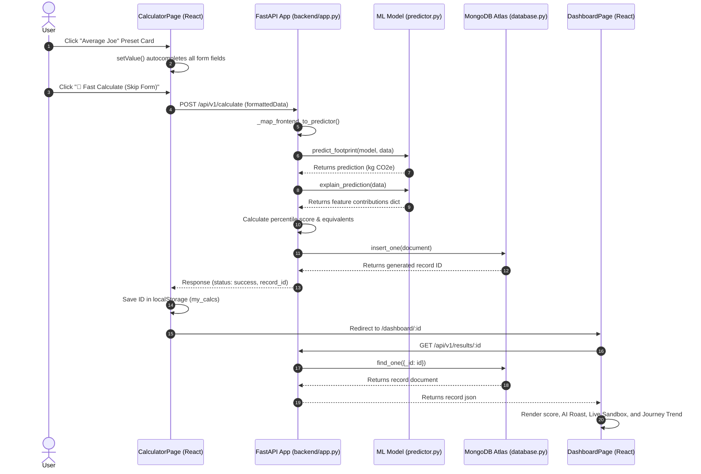
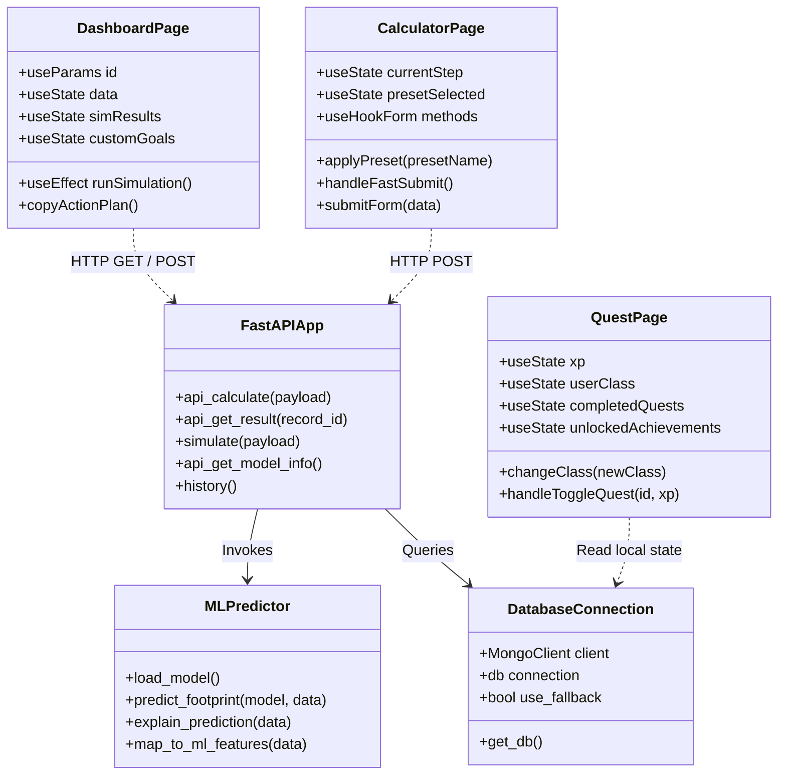

# CarbonCast — Full Technical System Documentation

Welcome to the comprehensive technical documentation for **CarbonCast**, an AI-powered carbon footprint estimator, dynamic sandbox simulator, and personalized sustainability tracker.

---

## 1. The 5W + 1H Product Framework

To understand the core purpose and utility of CarbonCast, we analyze it using the standard product design framework:

### Who
*   **Target Users**: CarbonCast is designed for individual citizens, eco-conscious consumers, and green community organizers who want a realistic understanding of their lifestyle footprint. It requires **no account registration or social login**, ensuring 100% user privacy.
*   **The AI/ML Model**: The backend model is trained on a localized community dataset representing diverse lifestyles (commuters, families, flight travelers, vegetarians, etc.).

### What
*   **The Problem**: Traditional carbon calculators are boring, preachy, and rely on rigid, simplistic multipliers (e.g., `km * 0.2` carbon). They feel like a spreadsheet and don't provide a compelling reason for long-term engagement.
*   **The Solution**: CarbonCast is a machine-learning-driven sustainability portal. It uses a trained regression model to analyze lifestyle choices, provides a live simulation sandbox to see hypothetical changes, roasts the user with witty AI copy, and plots their footprint journey over time.

### When
*   **Usage Milestones**: 
    1.  **Immediate Visit**: A user performs a **2-click fast calculation** using presets.
    2.  **Interactive Session**: The user experiments with the What-if Sandbox sliders to find realistic goals, copying their action checklist.
    3.  **Long-term Return**: The user returns bi-weekly or monthly to re-calculate their footprint after making real-world changes, tracking their progress on their personal Journey Line Chart.

### Where
*   **Execution & Hosting**: The application runs locally in a decoupled architecture (React frontend served by Vite, backend API served by FastAPI/Uvicorn). 
*   **Data Storage**: Calculation history is saved in a MongoDB Atlas cloud cluster (or local MongoDB fallback). User session logs, levels, and progress charts are stored locally in the browser's `localStorage` to preserve anonymity.

### Why
*   **The ML Advantage**: Standard calculators ignore multivariable interactions and statistical correlations. An ML pipeline compares multiple algorithms and extracts coefficients to understand *why* certain lifestyles emit more or less carbon.
*   **The Retention Driver**: By ditching boring eco-guilt and introducing a humorous AI roast, localized leveling quests, and a personal journey line chart, the site makes sustainability feel like a gamified RPG.

### How
*   **Footprint Estimation**: The user inputs lifestyle variables via synchronized range sliders. These are mapped to a 10-feature vector and predicted by the trained ML pipeline (`model.pkl`).
*   **Model Training**: The ML pipeline is trained on `dataset/carboncast.csv` using a custom column transformer and regressor pipeline. It calculates evaluation metrics ($R^2$, MAE, RMSE) and exports fit charts on-demand.

---

## 2. Machine Learning & Regression in Detail

### What is Regression?
In Machine Learning, **Regression** is a supervised learning task where the goal is to predict a **continuous numerical value** (a target variable, like $Y \in \mathbb{R}$) based on one or more independent variables (features, $X$). 

Unlike **Classification** (which predicts discrete labels like "Vegan" vs "Non-Vegetarian"), regression maps inputs directly to quantities. In CarbonCast, the target is the annual emissions output: `Total_CO2e` in kilograms.

### What is Linear Regression?
**Linear Regression** assumes a linear relationship between the input features and the numerical target. The mathematical model represents the target as a linear combination of features, plus an intercept term (representing the baseline footprint when all features are zero):

\[Y = \beta_0 + \beta_1 X_1 + \beta_2 X_2 + \dots + \beta_n X_n + \epsilon\]

Where:
*   \(Y\): Predicted carbon footprint (`Total_CO2e` in kg).
*   \(\beta_0\): The intercept (for our model, **93.185 kg**), which represents the baseline footprint of a hypothetical user.
*   \(\beta_i\): Feature coefficients (slopes) representing the impact of a single unit change in feature \(X_i\).
*   \(X_i\): Feature values (e.g. distance commuted, electricity consumed, flights taken).
*   \(\epsilon\): Residual error.

### How Regression Powers CarbonCast
In this project, Linear Regression won the algorithm competition (scoring an **$R^2$ of 0.8720** against Decision Trees and Random Forests). Because it is linear, we can extract the exact weights (coefficients) that the model learned from the `carboncast.csv` dataset:

*   **Distance Travelled**: $+0.086\text{ kg CO₂e}$ per km.
*   **Electricity Used**: $+0.681\text{ kg CO₂e}$ per kWh.
*   **Flights Taken**: $+1.296\text{ kg CO₂e}$ per round-trip flight.
*   **Diet Type**: Vegan diet subtracts $-0.32\text{ kg CO₂e}$ from the baseline, while vegetarian subtracts $-0.32\text{ kg CO₂e}$.
*   **Plastic Bottles**: Single-use plastic usage has a negative coefficient of $-0.526\text{ kg CO₂e}$ in the dataset due to collinearity with high-consumption variables.

### Explainable AI (XAI) Implementation
Because the model is linear, we can calculate the **exact absolute contribution** of each feature for a user's specific inputs:
\[\text{Contribution}_i = \beta_i \times X_i\]
On the dashboard, we display these contributions under **AI Driver Analysis**. This completely demystifies the "black box" of the AI model. The user sees exactly how the model arrived at their specific emissions number, which is impossible with non-linear models like deep neural networks.

---

## 3. UML System Diagrams

### A. Use Case Diagram
Describes the user's interactions with the CarbonCast system.

```mermaid
usecaseDiagram
    actor User as "Citizen / User"
    
    package CarbonCastSystem as "CarbonCast Portal" {
        usecase UC1 as "Autofill Lifestyle Presets"
        usecase UC2 as "Calculate Carbon Footprint"
        usecase UC3 as "Trigger Skip-Form Estimate"
        usecase UC4 as "Run What-If Simulations"
        usecase UC5 as "View AI Climate Roast"
        usecase UC6 as "Copy Custom Action Plan"
        usecase UC7 as "Track Carbon Journey History"
        usecase UC8 as "Complete Class-Specific Quests"
        usecase UC9 as "Download PDF Report"
    }

    User --> UC1
    User --> UC2
    User --> UC3
    User --> UC4
    User --> UC5
    User --> UC6
    User --> UC7
    User --> UC8
    User --> UC9
```

### B. Sequence Diagram
Traces the execution sequence of a user submitting a preset calculation, bypassing the form, and loading the interactive dashboard.



### C. Class / Component Diagram
Illustrates the structural relationship and dependencies of components across the stack.



---

## 4. Web Application Features Spec

Here is the exhaustive directory of all core features available in CarbonCast:

### 1. Lifestyle Presets (Quick Start Autocomplete)
*   **Technical Details**: Located in Step 0 of the calculator. Offers 3 presets (*Eco-Champion*, *Average Joe*, *High Consumer*).
*   **Functionality**: Clicking a preset card runs a key-value loop through the react-hook-form state, instantly setting pre-defined values for travel mileage, AC counts, flight trips, diets, and online shopping quantities.
*   **User Value**: Bypasses manual entry, helping the user understand "what a typical citizen emits" with zero upfront effort.

### 2. Form-Bypass Fast Calculate
*   **Technical Details**: Triggers the `handleFastSubmit()` hook in `CalculatorPage.tsx`.
*   **Functionality**: Extracts the current form values instantly, bypasses the Multi-Step wizard checkpoints, and submits the payload directly to the `/api/v1/calculate` endpoint.
*   **User Value**: Reduces estimation friction to exactly **2 clicks** (Click Preset -> Click Fast Calculate), preventing drop-offs caused by long forms.

### 3. Bidirectional Synchronized Controls & Context Badges
*   **Technical Details**: High-fidelity custom slider widgets rendered in `CalculatorPage.tsx` using HTML5 range sliders and number input boxes synced to React state.
*   **Functionality**: Dragging updates the input box; typing a number updates the slider bounds. Real-time context badges below (e.g. *"Low Commute"*, *"Heavy AC Usage"*) translate numeric values into descriptive user-friendly tags.
*   **User Value**: Offers both fast gamified estimation and precise manual overrides.

### 4. What-If Simulation Sandbox
*   **Technical Details**: Rendered on the dashboard page. Integrates with the backend `@app.post("/simulate")` route.
*   **Functionality**: User adjusts percentage sliders representing potential lifestyle reductions (e.g., driving 20% less). The card debounces changes and outputs their target simulated footprint, score, and absolute saved kg CO₂e in real-time.
*   **User Value**: Gamifies reduction goals during their single session, showing them the exact mathematical value of small behavioral adjustments.

### 5. Personal journey Progress Tracker
*   **Technical Details**: Renders a chronological line chart using the `recharts` library on the dashboard.
*   **Functionality**: Checks `localStorage.getItem('my_calcs')` for a list of calculation IDs. Fetches global history, filters for their IDs, and plots their footprint journey over time.
*   **User Value**: Incentivizes long-term repeat visits. Users return to re-calculate their footprint after making changes and watch their emissions curve drop over time.

### 6. Humorous AI Climate Roast & Review
*   **Technical Details**: An automated assessment block reading their Carbon Score and category.
*   **Functionality**: Feeds the numerical score into a satirical message selector. High emissions yield sharp, funny roasts, while eco-citizens get humorous praise.
*   **User Value**: Converts preachy, dry environmental lists into engaging, shareable, and viral content.

### 7. Class-Based Personalized Quests
*   **Technical Details**: RPG quest log page stored in `QuestPage.tsx`.
*   **Functionality**: Assigns the user to an Eco-Class (*VIP*, *Pragmatist*, *Guardian*) based on their score. Features custom quests which are dynamically filtered based on their calculator answers (hiding AC or flight tasks if inapplicable).
*   **User Value**: Offers realistic daily challenges that suit their current lifestyle class, rather than forcing public transit or veganism on everyone.

### 8. Downloadable PDF Reports
*   **Technical Details**: Exposes a download button triggering the `/api/v1/report/{id}` route.
*   **Functionality**: The python backend uses ReportLab and Matplotlib to compile score metrics, recommendations, and static breakdown charts into a professional, printable PDF.
*   **User Value**: Shareable and offline-friendly record of their carbon footprint assessment.

### 9. AI Model Transparency Card
*   **Technical Details**: Fetches metadata via `/api/v1/model-info`.
*   **Functionality**: Displays the regression algorithm, dataset size (500 rows), $R^2$, MAE, RMSE metrics, and prints the scatter regression plot fit graph.
*   **User Value**: Establishes mathematical credibility, proving that their score is estimated by a trained ML model rather than arbitrary hardcoded logic.

---

## 5. Execution & Setup

### Running Backend
```bash
cd backend
pip install -r requirements.txt
python app.py
```

### Running Frontend
```bash
cd frontend
npm install
npm run dev
```
