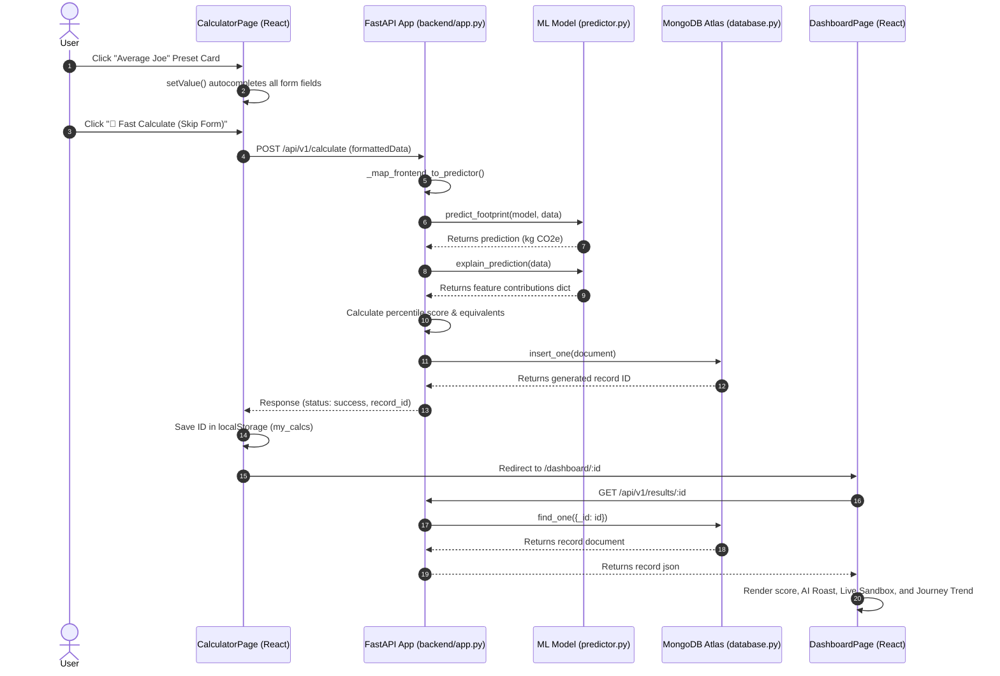
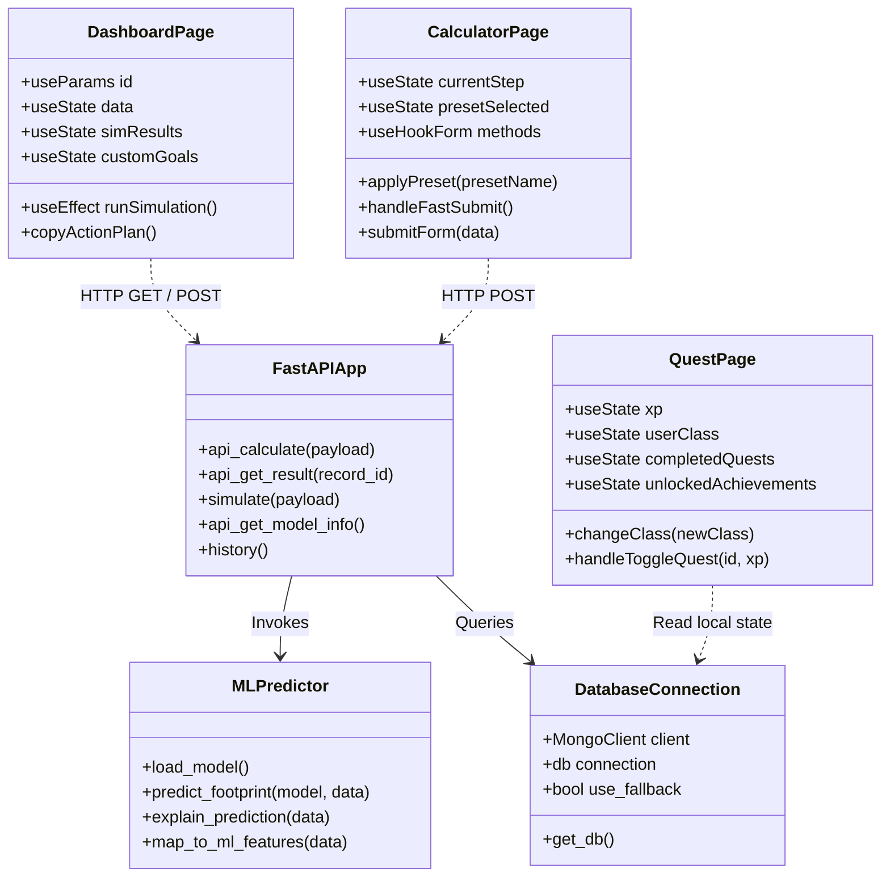

# CarbonCast — Full Technical System Documentation

Welcome to the comprehensive technical documentation for **CarbonCast**, an AI-powered carbon footprint estimator, dynamic sandbox simulator, and personalized sustainability tracker. 

This document is structured to be readable for both **non-technical stakeholders** (who want to understand the business value, user flow, and design logic) and **technical engineers** (who require details on math, algorithms, API endpoints, and class structures).

---

## 1. The 5W + 1H Product Framework (Expanded)

### WHO
*   **For Non-Technical Readers**: Designed for individual citizens, eco-conscious consumers, students, and home occupants looking to reduce utility bills and understand their personal climate impact. It requires **no account registration or social login**, ensuring 100% user privacy.
*   **For Technical Readers**: React Vite frontend client sending requests, FastAPI Python server orchestrating data, and MongoDB Atlas cloud storage.

### WHAT
*   **For Non-Technical Readers**: An interactive web calculator that tells you your carbon footprint, roasts you if it's high, helps you set personal goals with drag-and-drop sliders, and lets you download a checklist to your phone.
*   **For Technical Readers**: A machine learning regression model built with scikit-learn (`LinearRegression`) trained on a 500-sample CSV dataset, integrated with dynamic debounced simulate endpoints and browser-local quest caches.

### WHEN
*   **For Non-Technical Readers**: Used immediately to get a footprint score. Used long-term (every few weeks) to recalculate and check if your footprint graph has gone down.
*   **For Technical Readers**: Short-term calculations via `POST /api/v1/calculate`, real-time sliders querying `POST /simulate` debounced by 400ms, and chronological polling via `GET /history` filtered by IDs.

### WHERE
*   **For Non-Technical Readers**: Accessed on any web browser on your phone, laptop, or tablet. Data is stored privately on your browser and securely in a cloud database.
*   **For Technical Readers**: Hosted on localhost/port 5000 (backend) and port 5173 (frontend). Document writes are pushed to a remote MongoDB Atlas database cluster.

### WHY
*   **For Non-Technical Readers**: Standard calculators are boring and treat everyone the same. CarbonCast gamifies it like an RPG, gives personalized quests, and lets you play around with numbers.
*   **For Technical Readers**: Replaces simple arithmetic rule cards with an ML pipeline mapping multivariable correlations (collinear dependencies of waste, travel fuel, and diet types).

### HOW
*   **For Non-Technical Readers**: By estimating footprint from 11 easy lifestyle questions, using smart sliders, or skipping the form in 2 clicks.
*   **For Technical Readers**: Preprocesses categorical/numerical data via `ColumnTransformer`, imputes missing data using median values, and outputs prediction.

---

## 2. Data Analysis & The Machine Learning Pipeline

### What was done in Data Analysis?
*   **For Non-Technical Readers**: 
    We analyzed a dataset of 500 people's lifestyles to find what drives high carbon emissions. The analysis revealed that:
    1.  **Transport is key**: Long commutes in petrol/diesel cars and frequent flights are the biggest contributors.
    2.  **Diet matters**: Mixed diets (including beef/pork) add significant carbon, whereas vegan/vegetarian diets subtract carbon.
    3.  **Positive offset**: Planting trees acts as a direct negative emissions factor, helping offset daily footprints.
*   **For Technical Readers**:
    1.  **Dataset Load**: Loaded `dataset/carboncast.csv` using Pandas.
    2.  **Distribution Profile**: Evaluated the target column `Total_CO2e`. The dataset features a mean footprint of $271.72\text{ kg CO₂e}$ with a standard deviation of $80.87\text{ kg}$.
    3.  **Multicollinearity Checks**: Identified key collinear correlations, such as how fuel type changes the impact of travel distance, or how home type correlates with electricity usage.

### Understanding Regression & Linear Regression
*   **For Non-Technical Readers**: 
    *   **Regression** is a statistical tool used to predict a precise number (like your exact carbon footprint in kilograms) rather than just a category (like "High" or "Low").
    *   **Linear Regression** calculates a baseline "starting footprint" (intercept) and then adds or subtracts kilograms based on your answers. It's like a scale where every slider movement adds or removes specific weights.
*   **For Technical Readers**:
    Linear Regression models the target variable ($Y$) as a linear combination of feature variables ($X_i$) multiplied by learned slopes ($\beta_i$):
    \[Y = \beta_0 + \beta_1 X_1 + \beta_2 X_2 + \dots + \beta_n X_n + \epsilon\]
    *   **Intercept ($\beta_0$)**: $93.1853\text{ kg CO₂e}$ (the baseline footprint if all numerical features were zero).
    *   **Distance Travelled ($X_1$)**: $+0.0861\text{ kg CO₂e}$ per km.
    *   **Electricity ($X_2$)**: $+0.6809\text{ kg CO₂e}$ per kWh.
    *   **Flights ($X_3$)**: $+1.2960\text{ kg CO₂e}$ per trip.
    *   **Vegan Diet ($X_4$)**: Subtraction of $-0.0133\text{ kg}$ from the baseline.

### Explainable AI (XAI) Implementation
*   **For Non-Technical Readers**: 
    Instead of hiding the AI's math, we show the exact contribution of each factor (e.g., how many kilograms of carbon were added by your flights or subtracted by your trees).
*   **For Technical Readers**:
    Since the model is linear, the absolute contribution of feature $i$ is calculated directly:
    \[\text{Contribution}_i = \beta_i \times X_i\]
    This is displayed in the **AI Driver Analysis** chart on the dashboard, making the model's predictions fully transparent.

---

## 3. UML System Diagrams

### A. Use Case Diagram
```mermaid
usecaseDiagram
    actor User as "Citizen / User"
    
    package CarbonCastSystem as "CarbonCast Portal" {
        usecase UC1 as "Autofill Lifestyle Presets"
        usecase UC2 as "Calculate Carbon Footprint"
        usecase UC3 as "Trigger Skip-Form Estimate"
        usecase UC4 as "Run What-If Simulations"
        usecase UC5 as "View AI Climate Roast"
        usecase UC6 as "Copy Custom Action Plan"
        usecase UC7 as "Track Carbon Journey History"
        usecase UC8 as "Complete Class-Specific Quests"
        usecase UC9 as "Download PDF Report"
    }

    User --> UC1
    User --> UC2
    User --> UC3
    User --> UC4
    User --> UC5
    User --> UC6
    User --> UC7
    User --> UC8
    User --> UC9
```

### B. Sequence Diagram


### C. Class / Component Diagram


---

## 4. Technical Spec: What Was Done in the Frontend

*   **For Non-Technical Readers**: 
    We redesigned the interface to make it engaging, interactive, and fast. Instead of filling out long forms, users can get an estimate in **2 clicks** using lifestyle presets. On the results page, they can drag sliders to see how small changes reduce their emissions, copy their goals to their clipboard, and view a visual trend graph of their progress.
*   **For Technical Readers**:
    *   **Technologies Used**: React, Vite, TypeScript, Tailwind CSS, Recharts (for charts), Framer Motion (for animations), Lucide Icons, and React Hook Form.
    *   **Features & Architecture**:
        1.  **Fast Start Presets**: Step 0 autocompletes form values using pre-defined templates (`Eco-Champion`, `Average Joe`, `High Consumer`).
        2.  **Form Bypass (`handleFastSubmit`)**: Submits form values directly, bypassing remaining steps.
        3.  **Bidirectional Synchronized Controls**: Links range sliders and number input boxes to the same state. Includes dynamic badges (e.g. *"Low Commute"*).
        4.  **Simulation Sandbox**: Uses a debounced (400ms) effect hook to query the `/simulate` endpoint as sliders are dragged.
        5.  **Clipboard Exporter (`copyActionPlan`)**: Compiles goals into clean Markdown and copies them to the clipboard.
        6.  **Journey Progress Line Chart**: Filters global history records against IDs stored in `localStorage.getItem('my_calcs')` to plot a chronological trend.

---

## 5. Technical Spec: What Was Done in the Backend

*   **For Non-Technical Readers**: 
    We built a fast backend server that processes your answers, runs them through the trained AI model to calculate your emissions, saves your results, and generates printable PDF reports.
*   **For Technical Readers**:
    *   **Technologies Used**: FastAPI, Uvicorn, Scikit-Learn, Pandas, PyMongo (for MongoDB), ReportLab (for PDFs), and Matplotlib (for static charts).
    *   **Features & Architecture**:
        1.  **ML Inference Engine (`predictor.py`)**: Loads the serialized Scikit-Learn pipeline (`model.pkl`) to make predictions and extract feature coefficients.
        2.  **Simulation Engine (`simulator.py`)**: Computes hypothetical emissions reductions.
        3.  **MongoDB Handler (`database.py`)**: Connects to the database and automatically falls back to an in-memory dictionary-mock database if connection fails.
        4.  **PDF Report Compiler (`report.py`)**: Generates charts and compiles them into a printable PDF report.

---

## 6. Execution & Setup

### Running Backend
```bash
cd backend
pip install -r requirements.txt
python -m uvicorn app:app --host 0.0.0.0 --port 5000
```

### Running Frontend
```bash
cd frontend
npm install
npm run dev
```
